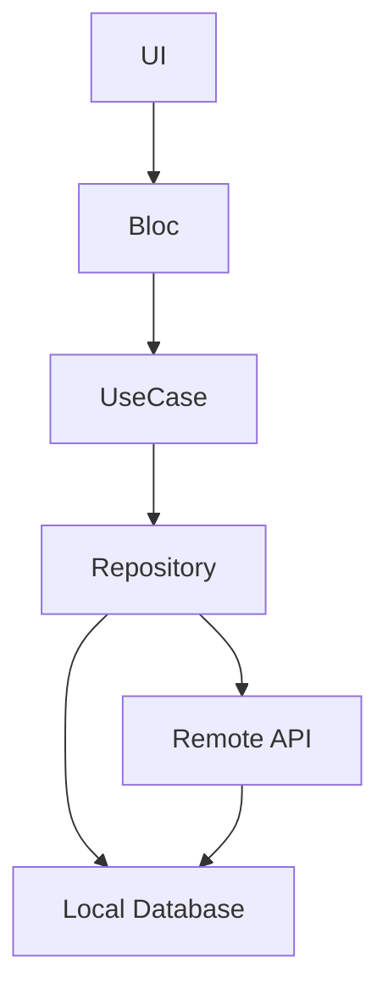
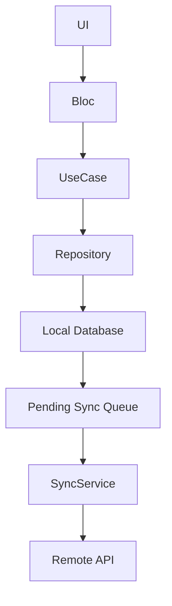

# 📦 Merchant Product Management App (Flutter)

A Flutter application for merchant product management built with an **offline-first** architecture using **Clean Architecture**, **Bloc**, **Drift**, and a mock REST API powered by **JSON Server**.

---

## 📌 Tech Stack

| Technology | Purpose |
|------------|---------|
| Flutter (Latest Stable) | Cross-platform UI |
| Bloc / Cubit | State Management |
| Drift (SQLite) | Local Database |
| Connectivity Plus | Network Monitoring |
| Clean Architecture | Project Structure |
| JSON Server | Mock Backend API |

---

## 🏗️ Project Architecture

The project follows **Clean Architecture** to separate responsibilities and improve maintainability.

```text
lib/
├── presentation/
│   ├── bloc/
│   ├── pages/
│   └── widgets/
│
├── domain/
│   ├── entities/
│   ├── repositories/
│   └── usecases/
│
└── data/
    ├── datasource/
    │   ├── local/      # Drift Database
    │   └── remote/     # REST API
    ├── models/
    ├── mapper/
    └── services/       # Sync Engine
```

---

## 🔄 Data Flow

### 📖 Read Flow (Offline-First)



**Flow:**

1. UI requests data.
2. Repository returns data from the local database.
3. Repository fetches fresh data from the API.
4. Local database is updated.
5. UI automatically reflects the latest data.

---

### ✍️ Write Flow (Offline-First)



**Flow:**

1. User performs an action.
2. Data is saved immediately to the local database.
3. The operation is added to the sync queue.
4. A background sync service sends pending changes to the server.
5. The queue is cleared after successful synchronization.

---

## 🧩 State Management

The application uses **Bloc / Cubit** for presentation logic.

### Responsibilities

| Layer | Responsibility |
|-------|----------------|
| UI | Sends events and renders state |
| Bloc / Cubit | Business logic & state management |
| Use Cases | Execute business rules |
| Repository | Coordinates local & remote data |
| Data Sources | Read/write local database and API |

---

## 🗄️ Local Storage

**Drift (SQLite)** is used for offline persistence.

### Stored Data

- 📦 Products
- 🔄 Pending synchronization queue

---

## 🚀 Getting Started

### 1. Install dependencies

```bash
flutter pub get
```

### 2. Start the mock backend

```bash
json-server --watch db.json --port 3000
```

### 3. Run the application

```bash
flutter run
```

---

## ✅ Features

- Offline-first product management
- Background synchronization
- Local persistence with Drift
- Clean Architecture
- Bloc/Cubit state management
- Mock REST API using JSON Server
